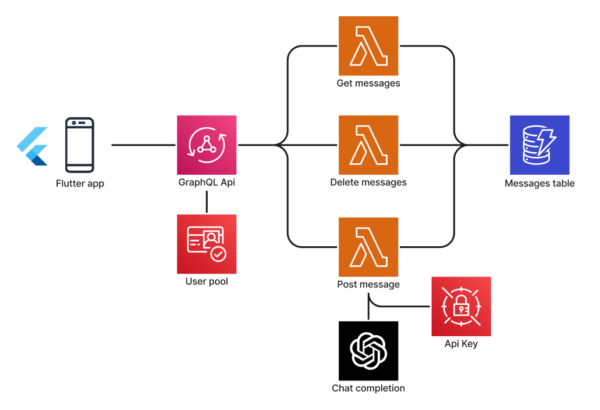

# Serverless chat demo

A quick demo to learn about GraphQL and tinker with the OpenAI Api. 

Users listen to changes in the chat room through GraphQL subscriptions using AWS Appsync.

The backend was built with the AWS CDK.

The mobile app was built with the Flutter framework, with the aid of GPT4.

